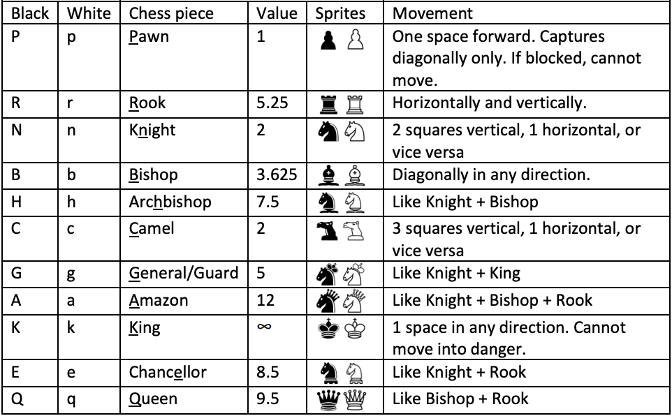
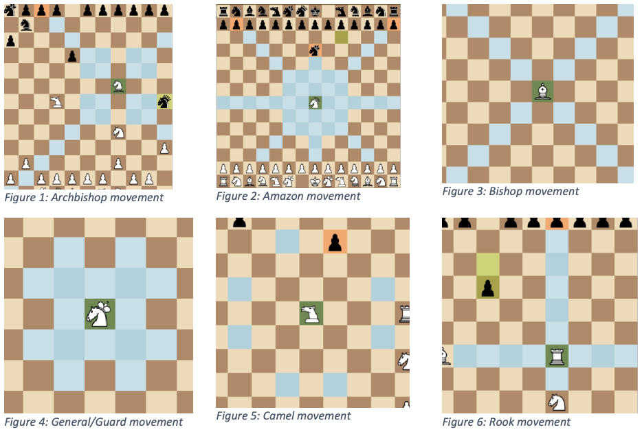
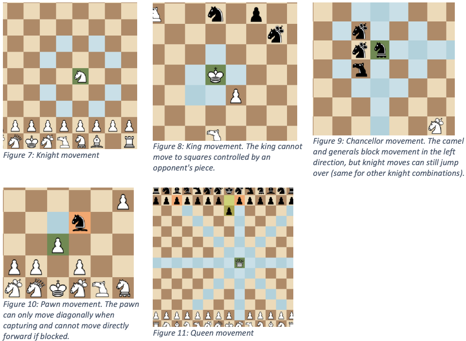
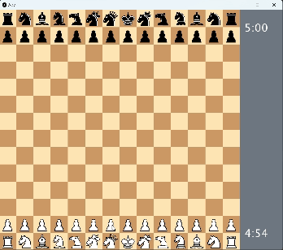
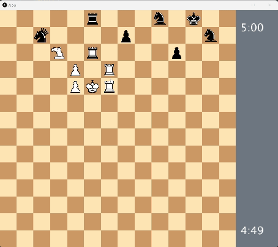
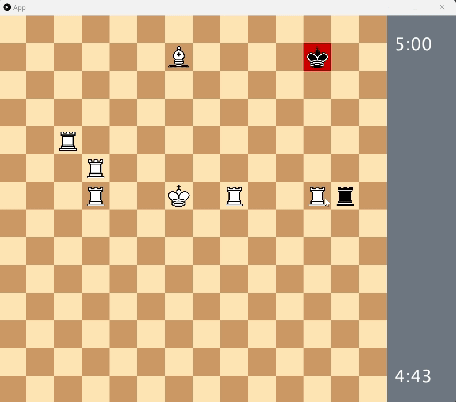

# XXL Chess

<p align='center'>
  
</p>

## Table of Contents
**[Overview](#Overview)**<br>
**[Dependencies](#Dependencies)**<br>
**[Execute](#Execute)**<br>
**[Board](#Board)**<br>
**[Configuration](#Configuration)**<br>
**[Movement](#Movement)**<br>
**[Check and Checkmate](#Check-and-Checkmate)**<br>
**[Ai movement](#AI-movement)**<br>
**[Win and lose conditions](#Win-and-Lose-conditions)**<br>
**[Extensions](#Extensions)**<br>
**[Acknowledgement](#Acknowledgement)**<br>

## Overview
We are creating a game in Java using the Processing library for graphics and gradle as a dependency manager. In the game, the player must be able to move chess pieces on a chess board in order to play against an AI, ultimately capturing the opponent’s pieces and executing a strategy to checkmate the opponent’s king.
Here's a [similar game]([https://www.youtube.com/watch?v=uGjgxwiemms](https://www.chess.com/terms/xxl-chess)).

## Getting Started

### Dependencies

* Java 8
* Gradle 8.3
* Java Processing library (specifically processing.core and processing.data)

### Execute

`cd` into `java-xxl-chess` then run:

```
gradle run
```

### Board

The board consists of a grid of tiles 14x14. The right sidebar is reserved for information such as timers showing the number of minutes and seconds remaining on each player’s clock, and warnings or other messages for the user. The window size is 792x672 and the tiles may change colour shade to indicate
highlights for particular reasons.

* There are 4 main types of highlights:

  * `Blue` – `player` clicked on a piece, and it is able to move to this square
  * `Light red` – selected piece can capture the current piece on this square
  * `Green` – the player’s currently selected piece
  * `Yellow` – the last piece to move, and the square it came from
  * `Dark red` – king on this square is currently in check, or checkmate (pieces that contribute to the checkmate are highlighted in light red)
 
### Configuration
 
* The initial piece layout is defined in a file named in the `layout` attribute of `config.json`. The layout file will contain a grid of text characters, where each character represents the piece that should be in that cell.
  
  * Uppercase characters are for black
  * Lowercase are for white
  * Empty spaces are empty tiles.
    
* The `time_controls` section contains the amount of time to be given to player 1 and player 2 (player 2 is the computer - cpu). Seconds it the total time they start with, which is consumed while they are thinking about a move. The `increment` is a number in seconds added to their remaining time once they make a
move.

* The `player_colour` property denotes the colour of the pieces of player 1 (the human player).
  * It should either have the value `white` or `black`.
  * If player 1 is white, then player 2 is black.
  * If player 1 is black, then player 2 is white.
  * Whoever is white has the first move, as in regular chess.

* The `piece_movement_speed` property in the config denotes how fast in pixels per frame a piece move should occur. This is limited by the `max_movement_time`, a number in seconds that the movement time should not exceed. If the movement would exceed this amount of time, the speed is increased to ensure it doesn’t take longer. Moves occur at a constant speed, with the chess piece smoothly transitioning in a straight line from its original position to its new position.

### Movement

* To trigger a move, the player must first select a piece by clicking on the cell it’s located in. Then, click to the cell the piece should move to. If the player instead selects one of their other pieces, then that piece becomes selected instead. If the player clicks on the selected piece again, or an invalid move, it becomes unselected.

<p align='center'>
  
</p>

* Normal movement of pieces is described in the table above. The king, queen, bishop, knight, rook and pawn all have the same movement as in regular 8x8 chess. For the purposes of pawn movement, “forward” is considered going up the board for the human player, and going down the board for the computer player.

<p align='center'>
  
</p>

<p align='center'>
  
</p>

* `Special moves`
  * A pawn can move two squares forward if it is located on 2nd row from the top or bottom of the board (rank 2 and rank 13), and has not moved before.
  * A king may perform a `castling` move if it has not moved before, which allows it to move two squares horizontally in either direction so long as there is also a rook towards the direction it will move (on the same rank), and that rook hasn’t moved. When this move is performed, the rook is placed on the other side of the king, adjacent to it.
  * `Pawn promotion`: When a pawn reaches the 8th rank (ie. when it crosses the halfway point on the 14x14 board), then it is promoted to a queen. It immediately turns into a queen and can be used as such in all subsequent moves
 
<p align='center'>
  
</p>
 
* Only a camel or knight move may jump over pieces (or the rook when castling), and a player may not move a piece onto a cell already containing one of their own pieces. If a move causes the piece to enter a tile containing one of the opponent’s pieces, the opponent’s piece is ‘captured’ and removed from the
board. All pieces capture on the same tiles as their regular movement, with the only exception being pawns which capture diagonally forwards instead, if there is a piece there. This is the only time they are allowed to move diagonally. If there is a piece directly in front of a pawn, it is blocked and cannot move to
the cell occupied by that piece.

Examples of possible moves for each piece are shown below.

### Check-and-Checkmate

* If after a move, a king is under attack, the king is said to be in `check`.
Under this circumstance, the player whose king is in check must do one
of the following (all must already be legal moves):

  * Move their king to a safe square
  * Move a piece to block the attack
  * Capture the attacking piece

<p align='center'>
  
</p>

* This is because otherwise, the player would lose their king on the next turn, and therefore lose the game. If none of these possibilities are available, then the player has been checkmated – there is no move available to them that would save their king, and they have lost.

* When check occurs, the king’s square is highlighted in dark red, and the message “Check!” appears in the right sidebar. If a player attempts to make an otherwise legal move that doesn’t protect their king, display a message on the right sidebar: “You must defend your king!”, and the highlighted cell the king is on will flash 3 times with a duration of 0.5 seconds each.

<p align='center'>
  
</p>

* A player cannot make a move that would result in their king coming under attack. This could be any of either:
  * Moving the king to a square which is under attack by the opponent
  * Moving a piece that is blocking an attack on their king by the opponent (this piece is said to be ‘pinned’)
  * Illegal moves due to check or pins win't be highlighted as blue tiles
when selecting a piece to potentially move it – only legal moves should be
highlighted.

### AI-movement

* Value of a move is tile value + piece value. The computer will choose the move with highest value.
* If there are multiple highest-value move, a random move will be chosen.
* If its king is under attack, it follows same rules as in `Check and Checkmate`.

<p align='center'>
  
</p>


### Win-and-Lose-conditions

* The game ends when either one player runs out of time, or their king is checkmated. Then other player wins.

* If the human player loses by checkmate, display a message saying “You lost by checkmate” in the right sidebar.

* If instead the cause was the timer, display “You lost on time”. The player can also `resign` the game by pressing `e` on the keyboard. The game ends and the message “You resigned” is displayed in the right sidebar.

* When the game ends, the board remains intact and frozen so that the player cannot make any moves (but may `restart` the game with the key press `r`).

* If checkmate occurred, the board should highlight the king of the checkmated player in red and the pieces contributing to checkmate in orange. Pieces contributing to checkmate are defined as a piece that is either attacking the king or one of the empty squares adjacent to it, or defending a piece that the king could otherwise capture. For each such square, there should only be one piece highlighted.

* If there are no legal moves for a player, then the game is considered a draw and enters the end state. Display the message “Stalemate – draw”.

### Extensions

* Sound effect

### Acknowledgement

The codebase is provided by unit **INFO1113 - University of Sydney.**

